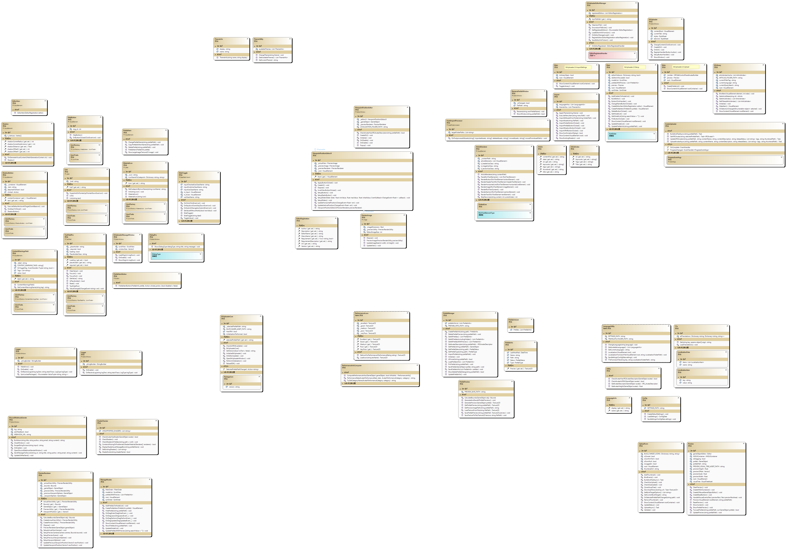

## Class Diagram

TODO: Write class descriptions for each group of class diagrams later.
For detailed method explanations, only public ones will be described, and private ones will be described in detail using documentation comments to reduce the maintenance burden of the documentation.

*Downloading the image is recommended.*

