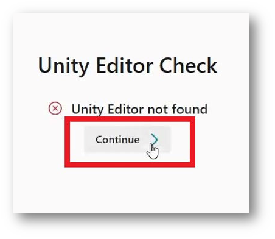
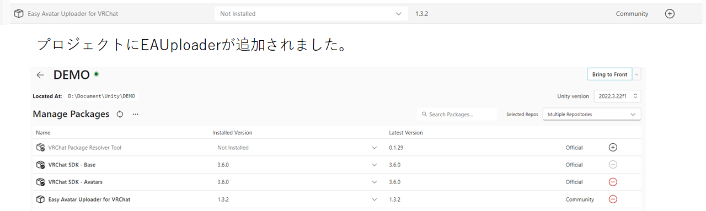

# 初めての方向けガイド

このガイドはアバター販売ショップが制作したものでなく、Project EAUploader が制作したものです。

公式キャラクター　いあ　デザイン　えびごはん

# 目次

- [**注意事項・免責事項**](https://www.notion.so/0242373641d6453daf917dbc912e8293?pvs=21)
- [**導入の方法**](https://www.notion.so/0242373641d6453daf917dbc912e8293?pvs=21)
  1. [導入内容の説明](https://www.notion.so/0242373641d6453daf917dbc912e8293?pvs=21)
  2. [こまったときは](https://www.notion.so/0242373641d6453daf917dbc912e8293?pvs=21)
  3. [導入の方法](https://www.notion.so/0242373641d6453daf917dbc912e8293?pvs=21)
     1. [Unity Hub のダウンロード](https://www.notion.so/0242373641d6453daf917dbc912e8293?pvs=21)
     2. [Unity Hub を起動](https://www.notion.so/0242373641d6453daf917dbc912e8293?pvs=21)
     3. [サインインの完了](https://www.notion.so/0242373641d6453daf917dbc912e8293?pvs=21)
     4. [Install Unity Editor をスキップ](https://www.notion.so/0242373641d6453daf917dbc912e8293?pvs=21)
     5. [ライセンスの認証](https://www.notion.so/0242373641d6453daf917dbc912e8293?pvs=21)
     6. [ライセンスの追加](https://www.notion.so/0242373641d6453daf917dbc912e8293?pvs=21)
     7. [Creator Companion をインストール](https://www.notion.so/0242373641d6453daf917dbc912e8293?pvs=21)
     8. [VCC を起動](https://www.notion.so/0242373641d6453daf917dbc912e8293?pvs=21)
     9. [Unity Editor のインストール](https://www.notion.so/0242373641d6453daf917dbc912e8293?pvs=21)
     10. [Unity インストール完了](https://www.notion.so/0242373641d6453daf917dbc912e8293?pvs=21)
     11. [Unity 準備完了](https://www.notion.so/0242373641d6453daf917dbc912e8293?pvs=21)
     12. [プロジェクトの作成](https://www.notion.so/0242373641d6453daf917dbc912e8293?pvs=21)
     13. [EAUploader の追加（VCC に EAUploader を追加）](https://www.notion.so/0242373641d6453daf917dbc912e8293?pvs=21)
     14. [プロジェクトの起動](https://www.notion.so/0242373641d6453daf917dbc912e8293?pvs=21)
     15. [導入・起動完了](https://www.notion.so/0242373641d6453daf917dbc912e8293?pvs=21)
- [**導入後**](https://www.notion.so/0242373641d6453daf917dbc912e8293?pvs=21)
  1. [ツール内のガイド](https://www.notion.so/0242373641d6453daf917dbc912e8293?pvs=21)
  2. [バックアップのとり方](https://www.notion.so/0242373641d6453daf917dbc912e8293?pvs=21)
- [**ご案内**](https://www.notion.so/0242373641d6453daf917dbc912e8293?pvs=21)
  1. [公式コミュニティのご案内](https://www.notion.so/0242373641d6453daf917dbc912e8293?pvs=21)
  2. [公式イベントのご案内](https://www.notion.so/0242373641d6453daf917dbc912e8293?pvs=21)
  3. [開発者・サポートクリエイター募集](https://www.notion.so/0242373641d6453daf917dbc912e8293?pvs=21)
  4. [こまったときは](https://www.notion.so/0242373641d6453daf917dbc912e8293?pvs=21)
  5. [お問い合わせ](https://www.notion.so/0242373641d6453daf917dbc912e8293?pvs=21)
- [**Option**](https://www.notion.so/0242373641d6453daf917dbc912e8293?pvs=21)
  1. [プロジェクトの起動（パッケージ Import）](https://www.notion.so/0242373641d6453daf917dbc912e8293?pvs=21)
  2. [EAUploader を追加](https://www.notion.so/0242373641d6453daf917dbc912e8293?pvs=21)

# 注意事項・免責事項

EAUploader は OSS(オープンソースソフトウェア)として開発、提供しているツールです。これは製品ではありません。
EAUploader を使用して発生したあらゆる損害について、Project EAUplaoder(uslog.tech)はいかなる責任も負いません。

Unity は様々なバグを抱えています。希に、予測されていない、解決できないバグやクラッシュが発生することがあります。最悪、プロジェクトが起動できなくなります(プロジェクトが壊れる)。
プロジェクトはバックアップをとるようにしてください([本ページ 導入後 バックアップのとり方 を参照](https://www.notion.so/0242373641d6453daf917dbc912e8293?pvs=21))。
また、アバターのデータなど大切なデータはプロジェクト外にも保存するようにしてください。

# 導入の方法

## 導入内容の説明

**導入するソフトウェア**

**・Unity Hub**
― Unity を管理するためのソフトです。
（Unity は多数のバージョンがあり、それぞれ独立したソフトウェアのため、Unity をまとめて管理、ライセンス認証を通すソフトが Unity Hub です）

**・Unity Editor**
― Unity 本体です。ただし、このガイドでは以下の Creator Companion を使用
　 して自動でインストールします。

**・Creator Companion**
― VRChat が配布している Unity プロジェクト管理ソフトです。
　 一般に、VCC と呼ばれています。

**導入するパッケージ（Unity に導入する追加の機能・ツール）**

**・VRCSDK**
― VRChat が配布しているアバターやワールドを作成、編集、アップロードする
　 ためのパッケージです。VCC で作成したプロジェクトには自動で追加されています。

**・EAUploader**
― EAUploader 本体です。Unity 上で動作します。

EAUploader での操作は Unity に変更を行うものです。Unity は通常作業状態
　 を保持するため、終了時に保存する操作は行いません。
　 EAUploader でのアバターのアップロードは、VRCSDK の機能を使用するも
　 のであり、VRCSDK を用いたアップロードと同じです。

## こまったときは

<aside>
💡 EAUploaderの導入、使用中に問題が発生したり、説明にないことが起こって解決できないとき
</aside>

- EAUploader 公式 Discord サーバーにご参加ください。 ▷ [https://discord.gg/yYFru7brra](https://discord.gg/yYFru7brra)
- URL が使用できない場合は公式サイトをご確認ください。 ▷ [https://eauploader.uslog.tech](https://eauploader.uslog.tech/)

<aside>
💡 UnityやVRCSDKの問題、購入したアバターやギミック、ツールに関する問題が発生したとき
</aside>

- それぞれの配布元のサポートを受けてください。
- サポートがない場合は X などで助けを求めてください。

## 導入の方法

### Unity Hub のダウンロード

以下のリンクから、UnityHub をダウンロードします。
[https://unity.com/ja/download](https://unity.com/ja/download)

### Unity Hub を起動

ダウンロードしたファイル UnityHubSetup.exe を実行してください。
起動後、以下のようにサインインを求められます。

初めての方は、アカウントを作成するために Sigh In ボタンの下にある$\color{#00B0F0}\textsf{Create account}$をクリックしてください。

### サインインの完了

画面に従ってアカウントを作成し、サインインまで行ってください。

サインインが完了したら、$\color{#00b0f0}\textsf{Got it}$をクリックして進めます。

※Unity Hub のバージョンによって表示が異なる可能性があります

### Install Unity Editor をスキップ

Unity Editor のインストール画面に遷移します。

ここでは$\color{#00b0f0}\textsf{Skip installation}$をクリックしてスキップしてください。
後のスキップにて、VCC からインストールを行います。

### ライセンスの認証

Unity Hub の通常の画面に遷移します。上部にライセンスの認証を求めるメッセージが表示されます。

右上のボタンからライセンスの認証画面に移ります。

### ライセンスの追加

ライセンスの管理画面に遷移します。ライセンスの一覧に何も表示されていないことを確認します。

$\color{#00b0f0}\textsf{Add license}$ボタンをクリックしてください。

個人ライセンス（無料）で認証を進めます。

$\color{#00b0f0}\textsf{}$$\color{#00b0f0}\textsf{Get a free personal license}$ボタンをクリックしてください。このライセンスでも Unity の通常のすべての機能を使用できます。
ライセンスは Unity アカウントに対して有効になります。

※ここではライセンス認証が行えれば問題ないため、他の認証方法で認証しても大丈夫です。

同意してライセンスを取得します。

これは Unity に対する同意です。内容を確認の上、同意をしてください。

ライセンスを追加したら Unity Hub での操作は完了です。

### Creator Companion をインストール

下記 URL より VRChat 公式が配布しているプロジェクト管理ソフトウェアをダウンロードしてください。
[https://vrchat.com/home/download](https://vrchat.com/home/download)

いくつかダウンロードのボタンがあるため注意してください。$\color{#00b0f0}\textsf{Download the Creator Companion}$をクリックしてダウンロードしてください。

※これが VCC と呼ばれるソフトです。

ダウンロードしたファイルを実行し、インストールを進めてください。

### VCC を起動

インストールが完了したら、起動してください。案内が始まります。

$\color{#00b0f0}\textsf{Show Me Around}$をクリックしてチュートリアルを開始します。

進めると、以下のような画面に遷移します。

$\color{#00b0f0}\textsf{Continue}$をクリックして進めてください。

### Unity Editor のインストール

少しのロード時間の後、Unity Editor が見つからないというログが発生します。

$\color{#00b0f0}\textsf{Continue}$をクリックして進めてください。

Unity をインストールするように案内が出ます。

$\color{#00b0f0}\textsf{Install Unity}$をクリックして進めてください。

公式が推奨する最新バージョンの Unity のインストールの画面となります。Install ボタンをクリックしてインストールしてください。

※Unity のインストールは少し時間がかかります

### Unity インストール完了

インストールが完了すると、画面が遷移します。

$\color{#00b0f0}\textsf{Continue}$をクリックして進めてください。

### Unity 準備完了

Unity と VCC のセットアップが完了しました。

続いて、$\color{#00b0f0}\textsf{Create New Project}$から新規プロジェクトを作成します。

### プロジェクトの作成

プロジェクトは大きく４種類に分かれます。
アバターとワールド用のプロジェクトが Unity2019 と 2022 用でそれぞれ２種ずつ４種類あります。

$\color{#00b0f0}\textsf{Unity 2022 Avatar Project}$を選択してください。Project Name には適当な名前をつけてください。
ただし全角文字は使用しないでください。アップロードできない原因となります。半角英数字と記号のみを使用してください。

入力後$\color{#00b0f0}\textsf{Create Project}$を選択して進みます。

### EAUploader の追加（VCC に EAUploader を追加）

プロジェクトの管理画面に遷移します。VCC パッケージはここから追加、更新、削除することができます。

VCC に EAUploader を追加するため、[ここ](https://eauploader.uslog.tech/)をクリックしてください。

自動で VCC にポップアップが表示されます。
$\color{#00b0f0}\textsf{I Understand, Add Repository}$をクリックして VCC に EAUploader を追加します。

Manage Packages の中から Easy Avatar Uploader for EAUploader を探して、⊕ ボタンをクリックして追加します。

### プロジェクトの起動

右上の$\color{#00b0f0}\textsf{Open Project}$から起動してください。

### 導入・起動完了

これでアバターをアップロードする準備が整いました。

VRM アバターを使用したい場合は別ガイド「VRM を使用する」を参照してください。

プロジェクトでは EAUploader を閉じて、通常の Unity エディタとしてアバターの改変を行うことも可能です。

左下は終了ボタンです。EAUplaoder を閉じる場合は右上の ✕ から閉じてください。

# 導入後

## ツール内のガイド

EAUploader はツール内にガイドがあります。

ツールの使い方やシェーダー、プラグイン、アップロードの説明など、ツールやアバター、作業に関する説明はツール内のガイドをお読みください。

## バックアップの取り方

VCC のプロジェクト一覧にて、バックアップをとりたいプロジェクトの一番右の…をクリックしてください。

バックアップの保存場所は VCC の左下 Settings より、Backups にて確認できます。また、ここで変更できます。

# ご案内

## 公式コミュニティのご案内

EAUploader の公式 Discord サーバーへ是非ご参加ください。
アップデートや、プロジェクトの最新情報を告知しています。

また、EAUploader へのご意見、ご提案も可能です。

是非、ご参加いただきたく思います。
[https://discord.gg/yYFru7brra](https://discord.gg/yYFru7brra)

## 公式イベントのご案内

VRChat にて隔週日曜日 21:00 よりイベントを開催しています。
プロジェクトの進捗報告、告知と交流会を行っています。

是非ご参加ください。

開発者も通常参加しています。

▽ VRChat グループに参加
[https://vrc.group/EAUP.0512](https://vrc.group/EAUP.0512)

## 開発者・サポートクリエイター募集

## こまったときは

<aside>
💡 EAUploaderの導入、使用中に問題が発生したり、説明にないことが起こって解決できないとき

</aside>

- EAUploader 公式 Discord サーバーにご参加ください。 ▷ [https://discord.gg/yYFru7brra](https://discord.gg/yYFru7brra)
- URL が使用できない場合は公式サイトをご確認ください。 ▷ [https://eauploader.uslog.tech](https://eauploader.uslog.tech/)

<aside>
💡 UnityやVRCSDKの問題、購入したアバターやギミック、ツールに関する問題が発生したとき

</aside>

- それぞれの配布元のサポートを受けてください。
- サポートがない場合は X などで助けを求めてください。

## お問い合わせ

私人、法人問わず Project EAUploader または運営元の USLOG へのお問い合わせは、以下よりお願いします。

[https://uslog.tech/contact](https://uslog.tech/contact)

初めての方向けガイド　 v1.0
2024 年 5 月 15 日
USLOG (uslog.tech)
Project EAUploader

# Option

## プロジェクトの起動（パッケージ Import）

プロジェクトの管理画面に遷移します。VCC パッケージはここから追加、更新、削除することができます。

何も変更せず$\color{#00b0f0}\textsf{Open Project}$をクリックしてください。Unity が起動します。

ここからは従来のパッケージをインポートして追加する方法での説明です。
特別な理由がない場合は、これより前にある「[VCC に EAUploader を追加](https://www.notion.so/0242373641d6453daf917dbc912e8293?pvs=21)」する方法で EAUploader を導入してください。

## EAUploader を追加

Unity が起動したら、ダウンロードした EAUploader のフォルダから Unity パッケージをドラック＆ドロップで追加します。

デフォルトの Unity の画面です。赤枠の中にファイルをドラックしてください。

インポート画面が表示されます。Import を押してインポートします。

インポート後、しばらくすると EAUploader が自動でプロジェクトに追加され、起動します。

このパッケージは EAUploader を VCC に追加するものです。インポート後、VCC には Easy Avatar Uploader for VRChat が追加されています。

２つ目以降のプロジェクトは、VCC で EAUploader を追加してください。
