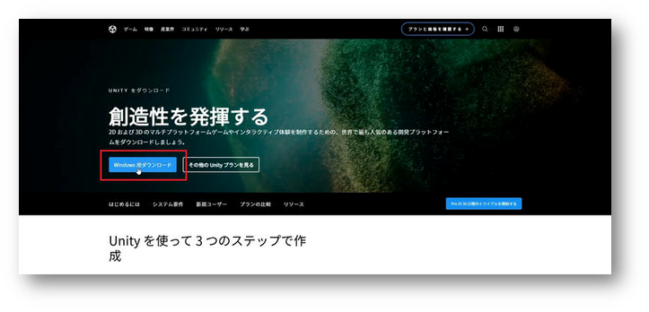
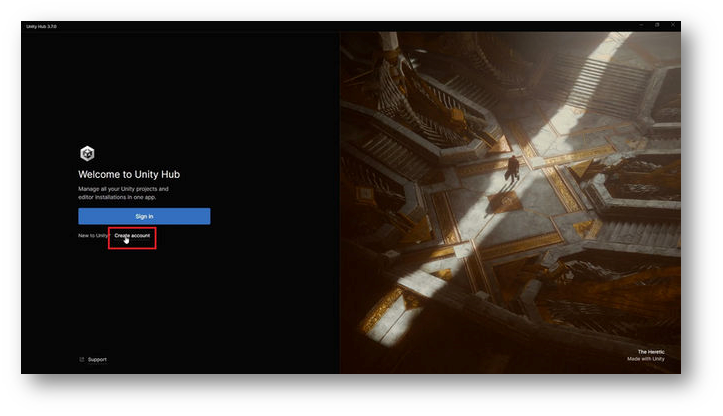
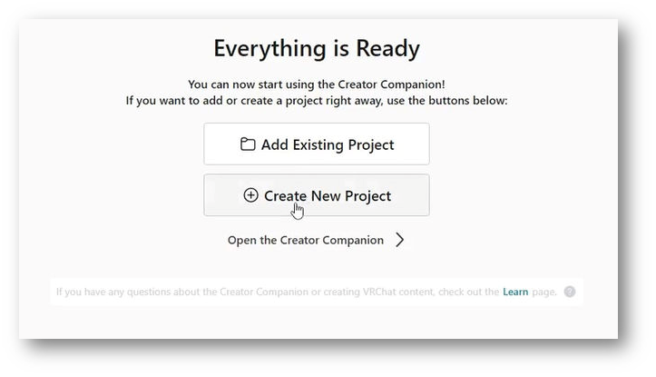
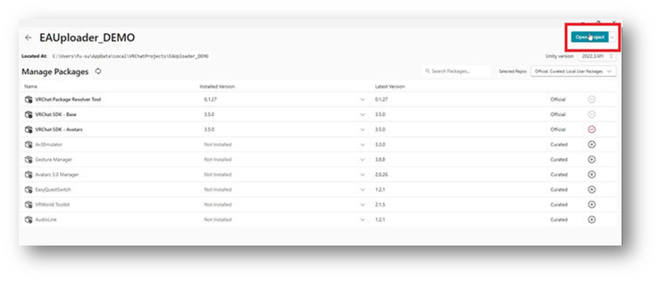

## Precautions & Disclaimer
* * *
EAUploader is developed and provided as OSS (Open Source Software). It is not a product.
Project EAUploader (uslog.tech) is not responsible for any damages that may occur as a result of using EAUploader.

Unity has various bugs. Occasionally, unpredictable, unresolved bugs or crashes may occur. In the worst case, the project may fail to launch (the project may break).
Please make sure to back up your projects.
Also, please save important data such as avatar data outside of the project.

## Description of What to Install
* * *
### Software to Install

**・Unity Hub**
- A software to manage Unity.
  (Since Unity has many versions, each acting as independent software, Unity Hub manages and authenticates licenses for Unity.)

**・Unity Editor**
- The main body of Unity. However, in this guide, it will be installed automatically using the following Creator Companion.

**・Creator Companion**
- A Unity project management software distributed by VRChat.
  Commonly known as VCC.

**Packages to Install (Additional features and tools to install in Unity)**

**・VRCSDK**
- A package distributed by VRChat for creating, editing, and uploading avatars and worlds. It is automatically added to projects created with VCC.

**・EAUploader**
- The main body of EAUploader. It operates within Unity.

Operations in EAUploader make changes in Unity. Unity does not save changes automatically to maintain the usual work state.
  Uploading avatars through EAUploader uses the features of VRCSDK and is the same as uploading using VRCSDK.

### If You Have Problems

<aside>
💡 If you encounter problems during the installation or use of EAUploader, or if something happens that is not explained and you cannot resolve it
</aside>

- Please join the official EAUploader Discord server. ▷ [https://discord.gg/yYFru7brra](https://discord.gg/yYFru7brra)
- If the URL is not available, please check the official website. ▷ [https://eauploader.uslog.tech](https://eauploader.uslog.tech/)

<aside>
💡 If you encounter problems with Unity or VRCSDK, or issues related to purchased avatars, gimmicks, or tools
</aside>

- Please seek support from their respective distributors.
- If there is no support available, seek help elsewhere, such as on platform X.

## How to Install
* * *
### Download Unity Hub

Download Unity Hub from the following link:
[https://unity.com/download](https://unity.com/download)

### Launch Unity Hub

Run the downloaded file UnityHubSetup.exe.
After launching, you will be asked to sign in.

If you are new, click Create account below the Sign In button.

### Complete the Sign-In

Follow the screens to create an account and sign in.

Once signed in, click Got it to proceed.

*Note: The display may vary depending on the version of Unity Hub*

### Skip Install Unity Editor

You will be taken to the Unity Editor installation screen.

Click Skip installation to skip this step.
Later, the installation will be done through VCC.

### License Authentication

You will return to the normal screen of Unity Hub. A message asking for license authentication will appear.

Go to the license authentication screen from the button in the upper right corner.

### Add a License

You will move to the license management screen. Make sure no licenses are displayed.

Click the Add license button.

Authenticate with a personal license (free).

Click the Get a free personal license button. This license allows you to use all the regular features of Unity.
The license will be activated for your Unity account.

*It's okay to authenticate using another method as long as the license is authenticated.*

Agree and obtain the license.

This is an agreement with Unity. Please check the content and agree.

Once you've added the license, you're done with the operations in Unity Hub.

### Install Creator Companion

Download the project management software distributed by VRChat from the following URL:
[https://vrchat.com/home/download](https://vrchat.com/home/download)

Be careful as there are several download buttons. Click Download the Creator Companion to download.

*This software is referred to as VCC.*

Run the downloaded file and proceed with the installation.

### Launch VCC

Once installed, start the software. Guidance will begin.

Click Show Me Around to start the tutorial.

Proceed, and you will move to the following screen.

Click Continue to proceed.

### Install Unity Editor

After a brief loading time, a log stating that the Unity Editor is not found will appear.

Click Continue to proceed.

You will be guided to install Unity.

Click Install Unity to proceed.

You will see the installation screen for the latest version of Unity recommended by the official. Click the Install button to proceed with the installation.

*Note: Installing Unity may take some time*

### Unity Installation Complete

Once the installation is complete, the screen will transition.

Click Continue to proceed.

### Unity Setup Complete

You have completed the setup of Unity and VCC.

Next, create a new project by selecting Create New Project.

### Create a Project

Projects are broadly divided into four types.
There are two types of projects for avatars and worlds each for Unity 2019 and 2022.

Please select Unity 2022 Avatar Project. Give the project a suitable name.
However, do not use full-width characters. It can cause issues during upload. Use only alphanumeric and symbols.

After entering, select Create Project to proceed.

### Add EAUploader (Add EAUploader to VCC)

You will move to the project management screen. VCC packages can be added, updated, or deleted from here.

To add EAUploader to VCC, click [here](https://eauploader.uslog.tech/).

A popup will automatically appear in VCC.
Click I Understand, Add Repository to add EAUploader to VCC.

Find Easy Avatar Uploader for EAUploader in Manage Packages and click the ⊕ button to add it.

### Launch the Project

Launch from Open Project in the upper right corner.

### Installation and Launch Complete

You are now ready to upload avatars.

If you want to use VRM avatars, please refer to the separate guide "Using VRM".

In the project, you can close EAUploader and modify the avatar as a regular Unity editor.

The button in the lower left is the exit button. To close EAUploader, click ✕ in the upper right corner.

## How to Use the Tool
* * *
### In-Tool Guide

EAUploader has a guide within the tool.

Please read the in-tool guide for explanations on tools, shaders, plugins, uploads, and related work.

### How to Back Up

In the VCC project list, click the ... on the far right of the project you want to back up.

The backup location can be confirmed in Settings at the bottom left of VCC, under Backups. You can also change it here.

## Information
* * *
### Official Community

Please join the official EAUploader Discord server.
We announce updates and the latest project information.

You can also provide feedback and suggestions to EAUploader.

Please join us.
https://discord.gg/yYFru7brra

### Official VRChat Group

We host events on VRChat.
Also, please join us when introducing EAUploader or for reference links.

https://vrc.group/EAUP.0512

### Developer & Support Creator Recruitment

### If You Have Problems

<aside>
💡 If you encounter problems during the installation or use of EAUploader, or if something happens that is not explained and you cannot resolve it

</aside>

- Please join the official EAUploader Discord server. ▷ [https://discord.gg/yYFru7brra](https://discord.gg/yYFru7brra)
- If the URL is not available, please check the official website. ▷ [https://eauploader.uslog.tech](https://eauploader.uslog.tech/)

<aside>
💡 If you encounter problems with Unity or VRCSDK, or issues related to purchased avatars, gimmicks, or tools

</aside>

- Please seek support from their respective distributors.
- If there is no support available, seek help elsewhere, such as on platform X.

### Contact Us

For inquiries from both individuals and corporations to Project EAUploader or the operating entity USLOG, please use the following link.

[https://uslog.tech/contact](https://uslog.tech/contact)

Guide for New Users v1.1

July 25, 2024

USLOG (uslog.tech)

Project EAUploader
