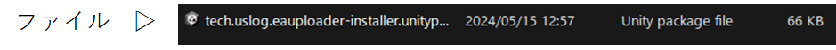

This guide is created by Project EAUploader, not by the Avatar Shop.

Official Character Ia Design Ebigohan

## Notes and Disclaimers

EAUploader is an open-source software tool developed and provided by Project EAUploader (uslog.tech). It is not a commercial product.
Project EAUploader (uslog.tech) is not responsible for any damages caused by the use of EAUploader.

Unity has various bugs. Occasionally, unexpected and unsolvable bugs or crashes may occur. In the worst case, the project may become unlaunchable (project corruption).
Please make sure to back up your project (refer to the section "How to Back Up After Installation" on this page).
Also, please save important data such as avatar data outside of the project.

## Explanation of Installation Content

### Software to Install

**- Unity Hub**
- Software for managing Unity.
- Unity has multiple versions, each being an independent software. Unity Hub is used to manage and authenticate Unity licenses.

**- Unity Editor**
- The main Unity software. However, in this guide, we will use Creator Companion for automatic installation.

**- Creator Companion**
- Unity project management software distributed by VRChat.
- Commonly referred to as VCC.

**Packages to Install (Additional Features/Tools to Install in Unity)**

**- VRCSDK**
- A package provided by VRChat for creating, editing, and uploading avatars and worlds.
- Automatically added to projects created with VCC.

**- EAUploader**
- The main EAUploader software. It runs on Unity.

Operations in EAUploader modify Unity. Unity normally maintains the working state, so it does not perform save operations when exiting.
Uploading avatars with EAUploader uses the functionality of VRCSDK, so it is the same as uploading with VRCSDK.

### When You're Stuck

<aside>
💡 If you encounter problems during the installation or use of EAUploader, or if something unexpected happens that you can't resolve based on the instructions:
</aside>

- Please join the official EAUploader Discord server. ▷ [https://discord.gg/yYFru7brra](https://discord.gg/yYFru7brra)
- If you can't use the URL, please check the official website. ▷ [https://eauploader.uslog.tech](https://eauploader.uslog.tech/)

<aside>
💡 If you encounter problems with Unity or VRCSDK, or have issues with purchased avatars, gimmicks, or tools:
</aside>

- Please seek support from the respective distributors.
- If there is no support available, seek help from other sources.

## Installation Instructions

### Download Unity Hub

Download UnityHub from the following link:
[https://unity.com/ja/download](https://unity.com/ja/download)

### Launch Unity Hub

Run the downloaded file UnityHubSetup.exe.
After launching, you will be prompted to sign in as shown below.

If you are a first-time user, click "Create account" below the Sign In button to create an account.

### Complete Sign In

Follow the on-screen instructions to create an account and complete the sign-in process.

After signing in, click "Got it" to proceed.

*The display may vary depending on the version of Unity Hub.

### Skip Install Unity Editor

You will be taken to the Unity Editor installation screen.

Click "Skip installation" to skip the installation.
The installation will be done later through VCC.

### License Authentication

You will be taken to the regular Unity Hub screen. A message requesting license authentication will be displayed at the top.

Click the button in the upper right corner to go to the license authentication screen.

### Add License

You will be taken to the license management screen. Make sure that no licenses are displayed in the list.

Click the "Add license" button.

Proceed with authentication using the personal license (free).

Click the "Get a free personal license" button. This license allows you to use all the regular features of Unity.
The license is valid for your Unity account.

*As long as the license authentication is successful, you can use other authentication methods.

Agree and obtain the license.

This is an agreement with Unity. Please review the content and agree to it.

Once you have added the license, the operations in Unity Hub are complete.

### Install Creator Companion

Download the project management software distributed by VRChat from the following URL:
[https://vrchat.com/home/download](https://vrchat.com/home/download)

Be careful as there are several download buttons. Click "Download the Creator Companion" to download.

*This is the software called VCC.

Run the downloaded file and proceed with the installation.

### Launch VCC

After the installation is complete, launch VCC. The tutorial will begin.

Click "Show Me Around" to start the tutorial.

As you progress, you will be taken to the following screen.

Click "Continue" to proceed.

### Install Unity Editor

After a short loading time, a log will appear stating that Unity Editor was not found.

Click "Continue" to proceed.

You will be prompted to install Unity.

Click "Install Unity" to proceed.

This is the installation screen for the latest version of Unity recommended by the official website. Click the "Install" button to install.

*Unity installation may take some time.

### Unity Installation Complete

After the installation is complete, the screen will transition.

Click "Continue" to proceed.

### Unity Ready

Unity and VCC setup are complete.

Next, create a new project by clicking "Create New Project".

### Creating a Project

Projects are divided into four main types.
There are two types each for avatars and worlds, for Unity 2019 and 2022.

Select "Unity 2022 Avatar Project". Enter a suitable name for the Project Name.
However, do not use full-width characters. It may cause upload issues. Please use only half-width alphanumeric characters and symbols.

After entering the name, click "Create Project" to proceed.

### Adding EAUploader (Adding EAUploader to VCC)

You will be taken to the project management screen. VCC packages can be added, updated, or removed from here.

To add EAUploader to VCC, click [here](https://eauploader.uslog.tech/).

A popup will automatically appear in VCC.
Click "I Understand, Add Repository" to add EAUploader to VCC.

Search for "Easy Avatar Uploader for EAUploader" in the Manage Packages section and click the ⊕ button to add it.

### Launching the Project

Click "Open Project" in the upper right corner to launch the project.

### Installation and Launch Complete

You are now ready to upload avatars.

If you want to use VRM avatars, please refer to the separate guide "Using VRM".

In the project, you can also modify avatars as a regular Unity editor by closing EAUploader.

The bottom left button is for exiting. If you want to close EAUploader, click the ✕ in the upper right corner.

## After Installation

### Guide within the Tool

EAUploader has a guide within the tool.

Please read the guide within the tool for instructions on how to use the tool, shaders, plugins, and uploading, as well as information about the tool, avatars, and tasks.

### How to Back Up After Installation

In the VCC project list, click the ... on the right side of the project for which you want to back up.

You can check the backup storage location in Settings at the bottom left of VCC. You can also change it here.

## Information

### Official Community Information

Please join the official EAUploader Discord server.
Updates and the latest information about the project are announced there.

You can also provide feedback and suggestions for EAUploader.

We highly recommend joining.
[https://discord.gg/yYFru7brra](https://discord.gg/yYFru7brra)

### Official Event Information

We hold events every other Sunday at 21:00 in VRChat.
We provide progress reports, announcements, and networking opportunities.

Please join us.

Developers also participate regularly.

▽ Join the VRChat group
[https://vrc.group/EAUP.0512](https://vrc.group/EAUP.0512)

### Developer and Support Creator Recruitment

### When You're Stuck

<aside>
💡 If you encounter problems during the installation or use of EAUploader, or if something unexpected happens that you can't resolve based on the instructions:
</aside>

- Please join the official EAUploader Discord server. ▷ [https://discord.gg/yYFru7brra](https://discord.gg/yYFru7brra)
- If you can't use the URL, please check the official website. ▷ [https://eauploader.uslog.tech](https://eauploader.uslog.tech/)

<aside>
💡 If you encounter problems with Unity or VRCSDK, or have issues with purchased avatars, gimmicks, or tools:
</aside>

- Please seek support from the respective distributors.
- If there is no support available, seek help from other sources.

### Contact

For inquiries to Project EAUploader or USLOG (uslog.tech), whether as an individual or a corporation, please use the following link:

[https://uslog.tech/contact](https://uslog.tech/contact)

Getting Started Guide for Beginners v1.0
May 15, 2024
USLOG (uslog.tech)
Project EAUploader

## Option

### Launching the Project (Package Import)

You will be taken to the project management screen. VCC packages can be added, updated, or removed from here.

Without making any changes, click "Open Project" to launch Unity.

This is the default Unity screen. Drag and drop the file into the red box.

The import screen will appear. Click "Import" to import.

After the import, EAUploader will be automatically added to the project and launched.

This package is for adding EAUploader to VCC. After importing, "Easy Avatar Uploader for VRChat" will be added to VCC.

For the second and subsequent projects, please add EAUploader to VCC.

