## 注意事項・免責事項
* * *
EAUploader は OSS(オープンソースソフトウェア)として開発、提供しているツールです。これは製品ではありません。
EAUploader を使用して発生したあらゆる損害について、Project EAUplaoder(uslog.tech)はいかなる責任も負いません。

Unity は様々なバグを抱えています。希に、予測されていない、解決できないバグやクラッシュが発生することがあります。最悪、プロジェクトが起動できなくなります(プロジェクトが壊れる)。
プロジェクトはバックアップをとるようにしてください。
また、アバターのデータなど大切なデータはプロジェクト外にも保存するようにしてください。

## 導入内容の説明
* * *
### 導入するソフトウェア

**・Unity Hub**
― Unity を管理するためのソフトです。
（Unity は多数のバージョンがあり、それぞれ独立したソフトウェアのため、Unity をまとめて管理、ライセンス認証を通すソフトが Unity Hub です）

**・Unity Editor**
― Unity 本体です。ただし、このガイドでは以下の Creator Companion を使用
　 して自動でインストールします。

**・Creator Companion**
― VRChat が配布している Unity プロジェクト管理ソフトです。
　 一般に、VCC と呼ばれています。

**導入するパッケージ（Unity に導入する追加の機能・ツール）**

**・VRCSDK**
― VRChat が配布しているアバターやワールドを作成、編集、アップロードする
　 ためのパッケージです。VCC で作成したプロジェクトには自動で追加されています。

**・EAUploader**
― EAUploader 本体です。Unity 上で動作します。

EAUploader での操作は Unity に変更を行うものです。Unity は通常作業状態
　 を保持するため、終了時に保存する操作は行いません。
　 EAUploader でのアバターのアップロードは、VRCSDK の機能を使用するも
　 のであり、VRCSDK を用いたアップロードと同じです。

### こまったときは

<aside>
💡 EAUploaderの導入、使用中に問題が発生したり、説明にないことが起こって解決できないとき
</aside>

- EAUploader 公式 Discord サーバーにご参加ください。 ▷ [https://discord.gg/yYFru7brra](https://discord.gg/yYFru7brra)
- URL が使用できない場合は公式サイトをご確認ください。 ▷ [https://eauploader.uslog.tech](https://eauploader.uslog.tech/)

<aside>
💡 UnityやVRCSDKの問題、購入したアバターやギミック、ツールに関する問題が発生したとき
</aside>

- それぞれの配布元のサポートを受けてください。
- サポートがない場合は X などで助けを求めてください。

## 導入の方法
* * *
### Unity Hub のダウンロード

以下のリンクから、UnityHub をダウンロードします。
[https://unity.com/ja/download](https://unity.com/ja/download)

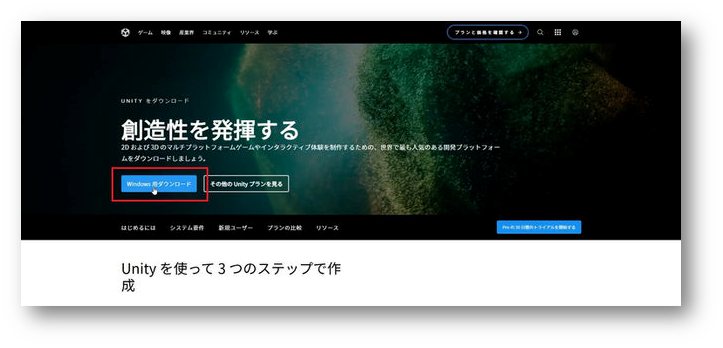

### Unity Hub を起動

ダウンロードしたファイル UnityHubSetup.exe を実行してください。
起動後、以下のようにサインインを求められます。

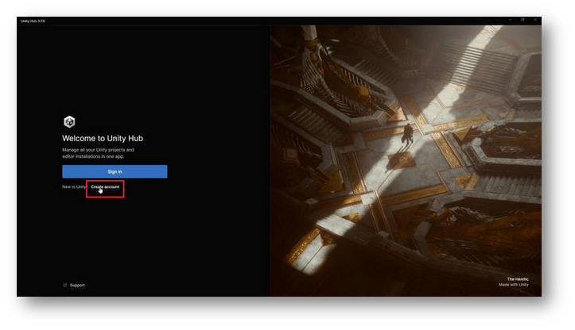

初めての方は、アカウントを作成するために Sigh In ボタンの下にあるCreate accountをクリックしてください。

### サインインの完了

画面に従ってアカウントを作成し、サインインまで行ってください。

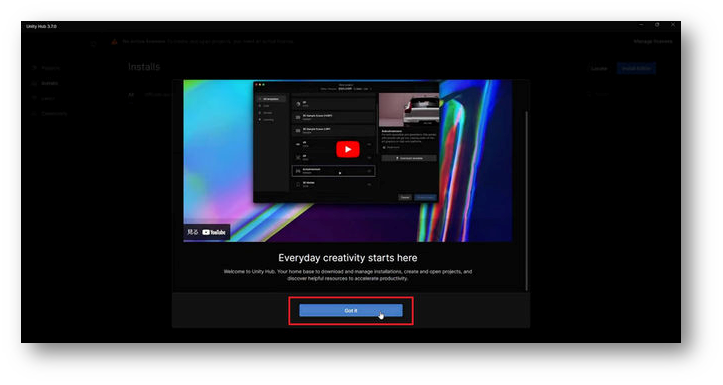

サインインが完了したら、Got itをクリックして進めます。

※Unity Hub のバージョンによって表示が異なる可能性があります

### Install Unity Editor をスキップ

Unity Editor のインストール画面に遷移します。

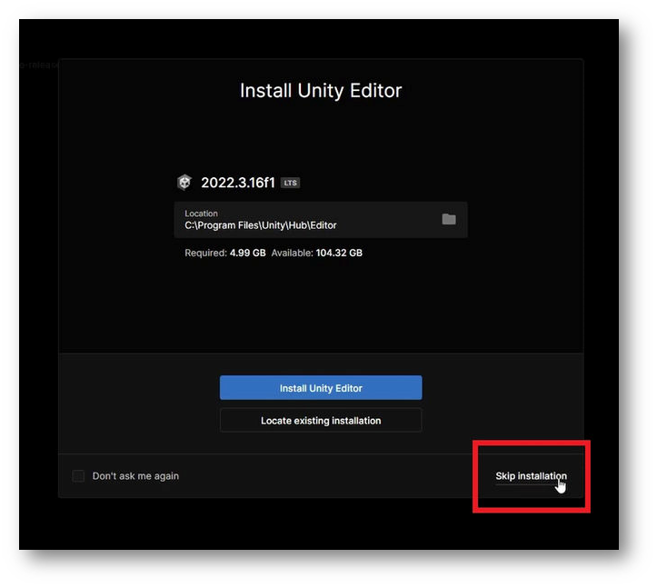

ここではSkip installationをクリックしてスキップしてください。
後のスキップにて、VCC からインストールを行います。

### ライセンスの認証

Unity Hub の通常の画面に遷移します。上部にライセンスの認証を求めるメッセージが表示されます。

右上のボタンからライセンスの認証画面に移ります。

### ライセンスの追加

ライセンスの管理画面に遷移します。ライセンスの一覧に何も表示されていないことを確認します。

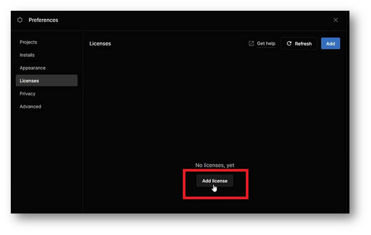

Add licenseボタンをクリックしてください。

個人ライセンス（無料）で認証を進めます。

Get a free personal licenseボタンをクリックしてください。このライセンスでも Unity の通常のすべての機能を使用できます。
ライセンスは Unity アカウントに対して有効になります。

※ここではライセンス認証が行えれば問題ないため、他の認証方法で認証しても大丈夫です。

同意してライセンスを取得します。

これは Unity に対する同意です。内容を確認の上、同意をしてください。

ライセンスを追加したら Unity Hub での操作は完了です。

### Creator Companion をインストール

下記 URL より VRChat 公式が配布しているプロジェクト管理ソフトウェアをダウンロードしてください。
[https://vrchat.com/home/download](https://vrchat.com/home/download)

いくつかダウンロードのボタンがあるため注意してください。Download the Creator Companionをクリックしてダウンロードしてください。

※これが VCC と呼ばれるソフトです。

ダウンロードしたファイルを実行し、インストールを進めてください。

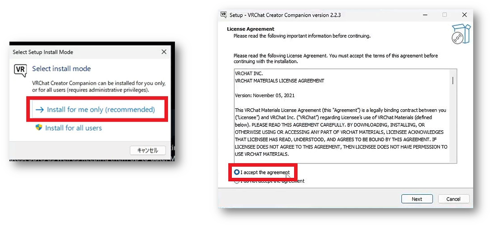

### VCC を起動

インストールが完了したら、起動してください。案内が始まります。

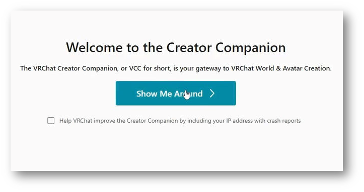

Show Me Aroundをクリックしてチュートリアルを開始します。

進めると、以下のような画面に遷移します。

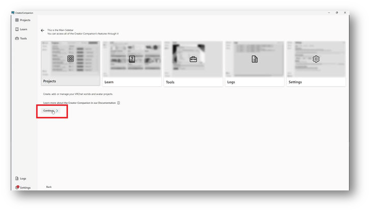

Continueをクリックして進めてください。

### Unity Editor のインストール

少しのロード時間の後、Unity Editor が見つからないというログが発生します。

Continueをクリックして進めてください。

Unity をインストールするように案内が出ます。

Install Unityをクリックして進めてください。

公式が推奨する最新バージョンの Unity のインストールの画面となります。Install ボタンをクリックしてインストールしてください。

※Unity のインストールは少し時間がかかります

### Unity インストール完了

インストールが完了すると、画面が遷移します。

Continueをクリックして進めてください。

### Unity 準備完了

Unity と VCC のセットアップが完了しました。

続いて、Create New Projectから新規プロジェクトを作成します。

### プロジェクトの作成

プロジェクトは大きく４種類に分かれます。
アバターとワールド用のプロジェクトが Unity2019 と 2022 用でそれぞれ２種ずつ４種類あります。

Unity 2022 Avatar Projectを選択してください。Project Name には適当な名前をつけてください。
ただし全角文字は使用しないでください。アップロードできない原因となります。半角英数字と記号のみを使用してください。

入力後Create Projectを選択して進みます。

### EAUploader の追加（VCC に EAUploader を追加）

プロジェクトの管理画面に遷移します。VCC パッケージはここから追加、更新、削除することができます。

VCC に EAUploader を追加するため、[ここ](https://eauploader.uslog.tech/)をクリックしてください。

自動で VCC にポップアップが表示されます。
I Understand, Add Repositoryをクリックして VCC に EAUploader を追加します。

Manage Packages の中から Easy Avatar Uploader for EAUploader を探して、⊕ ボタンをクリックして追加します。

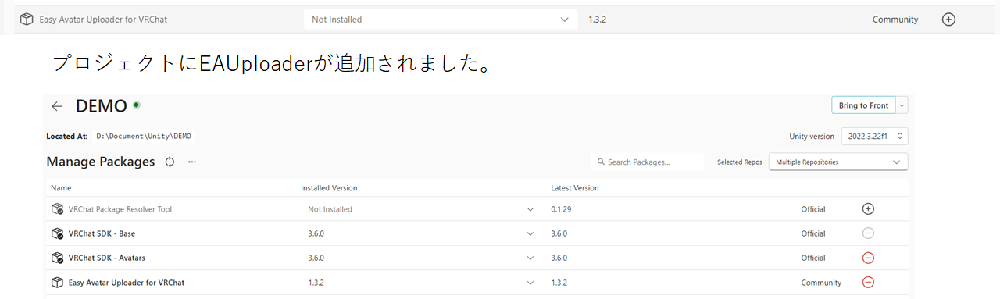

### プロジェクトの起動

右上のOpen Projectから起動してください。

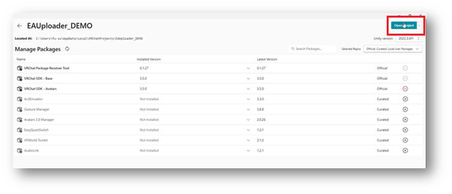

### 導入・起動完了

これでアバターをアップロードする準備が整いました。

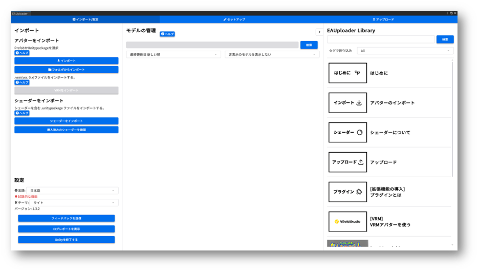

VRM アバターを使用したい場合は別ガイド「VRM を使用する」を参照してください。

プロジェクトでは EAUploader を閉じて、通常の Unity エディタとしてアバターの改変を行うことも可能です。

左下は終了ボタンです。EAUplaoder を閉じる場合は右上の ✕ から閉じてください。

## ツールの使い方
* * *
### ツール内のガイド

EAUploader はツール内にガイドがあります。

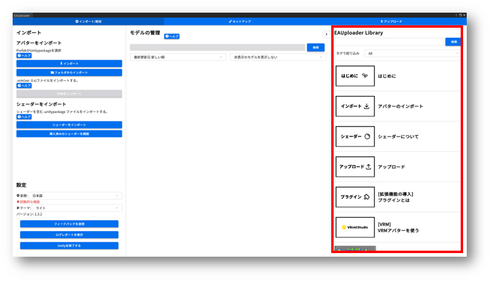

ツールの使い方やシェーダー、プラグイン、アップロードの説明など、ツールやアバター、作業に関する説明はツール内のガイドをお読みください。

### バックアップの取り方

VCC のプロジェクト一覧にて、バックアップをとりたいプロジェクトの一番右の…をクリックしてください。

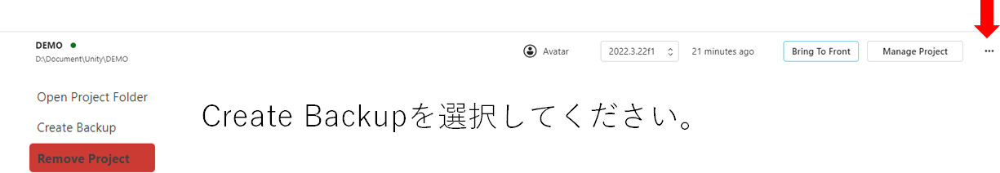

バックアップの保存場所は VCC の左下 Settings より、Backups にて確認できます。また、ここで変更できます。

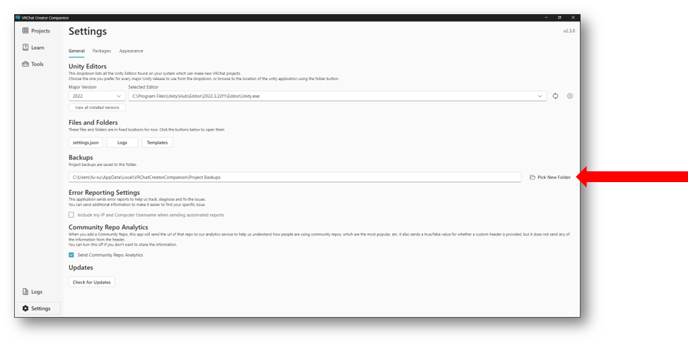

## ご案内
* * *
### 公式コミュニティ

EAUploader の公式 Discord サーバーへ是非ご参加ください。
アップデートや、プロジェクトの最新情報を告知しています。

また、EAUploader へのご意見、ご提案も可能です。

是非、ご参加ください。
https://discord.gg/yYFru7brra

### 公式VRChatグループ

VRChatにてイベントを開催しています。
また、EAUploaderを紹介する際などにリンクの参照として是非ご参加ください。

https://vrc.group/EAUP.0512

### 開発者・サポートクリエイター募集

### こまったときは

<aside>
💡 EAUploaderの導入、使用中に問題が発生したり、説明にないことが起こって解決できないとき

</aside>

- EAUploader 公式 Discord サーバーにご参加ください。 ▷ [https://discord.gg/yYFru7brra](https://discord.gg/yYFru7brra)
- URL が使用できない場合は公式サイトをご確認ください。 ▷ [https://eauploader.uslog.tech](https://eauploader.uslog.tech/)

<aside>
💡 UnityやVRCSDKの問題、購入したアバターやギミック、ツールに関する問題が発生したとき

</aside>

- それぞれの配布元のサポートを受けてください。
- サポートがない場合は X などで助けを求めてください。

### お問い合わせ

私人、法人問わず Project EAUploader または運営元の USLOG へのお問い合わせは、以下よりお願いします。

[https://uslog.tech/contact](https://uslog.tech/contact)

初めての方向けガイド v1.1

2024 年 7 月 25 日

USLOG (uslog.tech)

Project EAUploader
