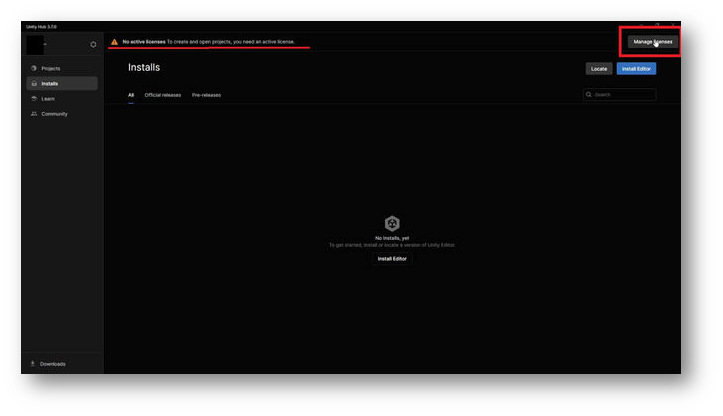
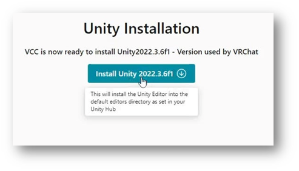
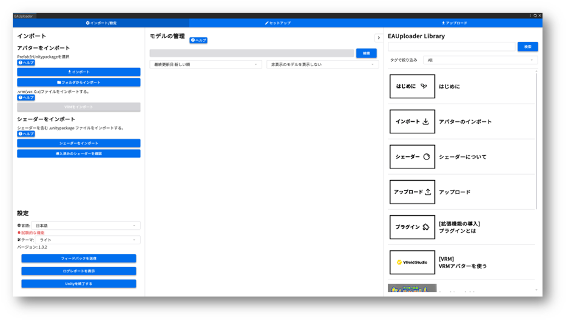
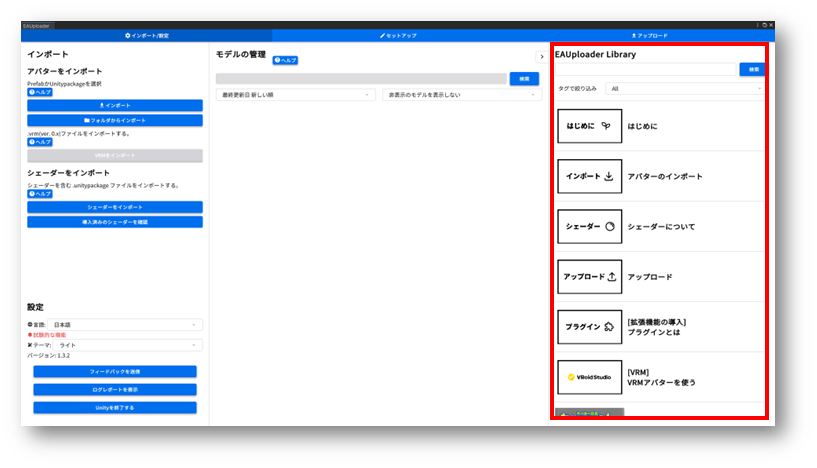

이 가이드는 아바타 판매 샵에서 제작한 것이 아니라 Project EAUploader에서 제작한 것입니다. 

공식 캐릭터 이아 디자인 에비고한

## 주의사항・면책사항

EAUploader는 OSS(오픈소스 소프트웨어)로 개발, 제공하는 툴입니다. 이것은 제품이 아닙니다. 
EAUploader를 사용해서 발생한 모든 손해에 대해 Project EAUploader(uslog.tech)는 어떠한 책임도 지지 않습니다.

Unity는 다양한 버그를 안고 있습니다. 드물게 예측되지 않은, 해결할 수 없는 버그나 크래시가 발생할 수 있습니다. 최악의 경우 프로젝트가 시작되지 않을 수 있습니다(프로젝트가 망가짐). 
프로젝트는 백업을 하도록 해주세요([본 페이지 도입 후 백업 방법 참조](https://www.notion.so/0242373641d6453daf917dbc912e8293?pvs=21)). 
또한 아바타 데이터 등 중요한 데이터는 프로젝트 외부에도 저장하도록 해주세요.

## 도입 내용 설명

### 도입하는 소프트웨어 

**・Unity Hub**
― Unity를 관리하기 위한 소프트웨어입니다.
(Unity는 다수의 버전이 있고, 각각 독립된 소프트웨어이기 때문에 Unity를 함께 관리하고 라이선스 인증을 통과하는 소프트웨어가 Unity Hub입니다)

**・Unity Editor**  
― Unity 본체입니다. 단, 이 가이드에서는 아래의 Creator Companion을 사용해서 자동으로 설치합니다.

**・Creator Companion**
― VRChat이 배포하는 Unity 프로젝트 관리 소프트웨어입니다. 
일반적으로 VCC라고 불립니다.

**도입하는 패키지(Unity에 도입하는 추가 기능・툴)**

**・VRCSDK**
― VRChat이 배포하는 아바타나 월드를 제작, 편집, 업로드하기 위한 패키지입니다. VCC로 만든 프로젝트에는 자동으로 추가되어 있습니다.

**・EAUploader**  
― EAUploader 본체입니다. Unity 상에서 동작합니다.

EAUploader에서의 조작은 Unity에 변경을 가하는 것입니다. Unity는 통상 작업 상태를 유지하기 때문에 종료 시 저장하는 조작은 하지 않습니다.
EAUploader에서의 아바타 업로드는 VRCSDK의 기능을 사용하는 것이며, VRCSDK를 이용한 업로드와 동일합니다.

### 곤란할 때는

<aside>
💡 EAUploader의 도입, 사용 중에 문제가 발생하거나 설명에 없는 일이 일어나서 해결할 수 없을 때
</aside>

- EAUploader 공식 Discord 서버에 참가해 주세요. ▷ [https://discord.gg/yYFru7brra](https://discord.gg/yYFru7brra) 
- URL이 사용할 수 없는 경우는 공식 사이트를 확인해 주세요. ▷ [https://eauploader.uslog.tech](https://eauploader.uslog.tech/)

<aside>
💡 Unity나 VRCSDK의 문제, 구매한 아바타나 기믹, 툴에 관한 문제가 발생했을 때  
</aside>

- 각각의 배포처의 지원을 받아주세요.
- 지원이 없는 경우는 X 등에서 도움을 요청해 주세요.

## 도입 방법

### Unity Hub 다운로드

아래 링크에서 UnityHub을 다운로드합니다.
[https://unity.com/ja/download](https://unity.com/ja/download)

### Unity Hub 실행

다운로드한 파일 UnityHubSetup.exe를 실행해 주세요.
실행 후 아래와 같이 로그인을 요구합니다.

처음이신 분은 계정을 만들기 위해 Sign In 버튼 아래에 있는 Create account를 클릭해 주세요.

### 로그인 완료

화면에 따라 계정을 만들고 로그인까지 진행해 주세요.

로그인이 완료되면 Got it을 클릭해서 진행합니다.

※Unity Hub의 버전에 따라 표시가 다를 수 있습니다

### Install Unity Editor 스킵

Unity Editor의 설치 화면으로 이동합니다.

여기서는 Skip installation을 클릭해서 스킵해 주세요.
뒤의 스킵에서 VCC로부터 설치를 진행합니다.

### 라이선스 인증

Unity Hub의 일반 화면으로 이동합니다. 상단에 라이선스 인증을 요구하는 메시지가 표시됩니다.

오른쪽 상단 버튼에서 라이선스 인증 화면으로 이동합니다.

### 라이선스 추가

라이선스 관리 화면으로 이동합니다. 라이선스 목록에 아무것도 표시되지 않는 것을 확인합니다.

Add license 버튼을 클릭해 주세요.

개인 라이선스(무료)로 인증을 진행합니다.

Get a free personal license 버튼을 클릭해 주세요. 이 라이선스로도 Unity의 일반적인 모든 기능을 사용할 수 있습니다.
라이선스는 Unity 계정에 대해 유효하게 됩니다.

※여기서는 라이선스 인증이 되면 문제없으므로 다른 인증 방법으로 인증해도 괜찮습니다.

동의하고 라이선스를 취득합니다.

이것은 Unity에 대한 동의입니다. 내용을 확인하고 동의해 주세요.

라이선스를 추가하면 Unity Hub에서의 조작은 완료입니다.

### Creator Companion 설치

아래 URL에서 VRChat 공식이 배포하는 프로젝트 관리 소프트웨어를 다운로드해 주세요.
[https://vrchat.com/home/download](https://vrchat.com/home/download)

몇 개의 다운로드 버튼이 있으므로 주의해 주세요. Download the Creator Companion을 클릭해서 다운로드해 주세요.

※이것이 VCC라고 불리는 소프트웨어입니다.

다운로드한 파일을 실행하고 설치를 진행해 주세요.

### VCC 실행

설치가 완료되면 실행해 주세요. 안내가 시작됩니다.

Show Me Around을 클릭해서 튜토리얼을 시작합니다.

진행하면 아래와 같은 화면으로 이동합니다.

Continue를 클릭해서 진행해 주세요.

### Unity Editor 설치

잠시 로딩 시간이 지난 후 Unity Editor가 발견되지 않는다는 로그가 발생합니다.

Continue를 클릭해서 진행해 주세요.

Unity를 설치하라는 안내가 나옵니다.

Install Unity를 클릭해서 진행해 주세요.

공식이 추천하는 최신 버전의 Unity 설치 화면이 됩니다. Install 버튼을 클릭해서 설치해 주세요.

※Unity 설치는 조금 시간이 걸립니다

### Unity 설치 완료

설치가 완료되면 화면이 이동합니다.

Continue를 클릭해서 진행해 주세요.

### Unity 준비 완료

Unity와 VCC의 셋업이 완료되었습니다.

계속해서 Create New Project에서 새로운 프로젝트를 만듭니다.

### 프로젝트 생성

프로젝트는 크게 4종류로 나뉩니다.
아바타와 월드용 프로젝트가 Unity2019와 2022용으로 각각 2종류씩 4종류가 있습니다.

Unity 2022 Avatar Project를 선택해 주세요. Project Name에는 적당한 이름을 붙여주세요.
단, 전각 문자는 사용하지 마세요. 업로드할 수 없는 원인이 됩니다. 반각 영숫자와 기호만 사용해 주세요.

입력 후 Create Project를 선택해서 진행합니다.

### EAUploader 추가(VCC에 EAUploader 추가)

프로젝트 관리 화면으로 이동합니다. VCC 패키지는 여기서 추가, 업데이트, 삭제할 수 있습니다.

VCC에 EAUploader를 추가하기 위해 [여기](https://eauploader.uslog.tech/)를 클릭해 주세요.

자동으로 VCC에 팝업이 표시됩니다.
I Understand, Add Repository를 클릭해서 VCC에 EAUploader를 추가합니다.

Manage Packages 중에서 Easy Avatar Uploader for EAUploader를 찾아 ⊕ 버튼을 클릭해서 추가합니다.

### 프로젝트 실행

오른쪽 상단의 Open Project에서 실행해 주세요.

### 도입・실행 완료

이것으로 아바타를 업로드할 준비가 되었습니다.

VRM 아바타를 사용하고 싶은 경우는 별도 가이드 "VRM을 사용하기"를 참조해 주세요.

프로젝트에서는 EAUploader를 닫고 일반적인 Unity 에디터로서 아바타 수정을 할 수도 있습니다.

왼쪽 아래는 종료 버튼입니다. EAUploader를 닫을 경우는 오른쪽 상단의 ✕에서 닫아주세요.

## 도입 후

### 툴 내의 가이드

EAUploader는 툴 내에 가이드가 있습니다.

툴 사용법이나 셰이더, 플러그인, 업로드 설명 등 툴이