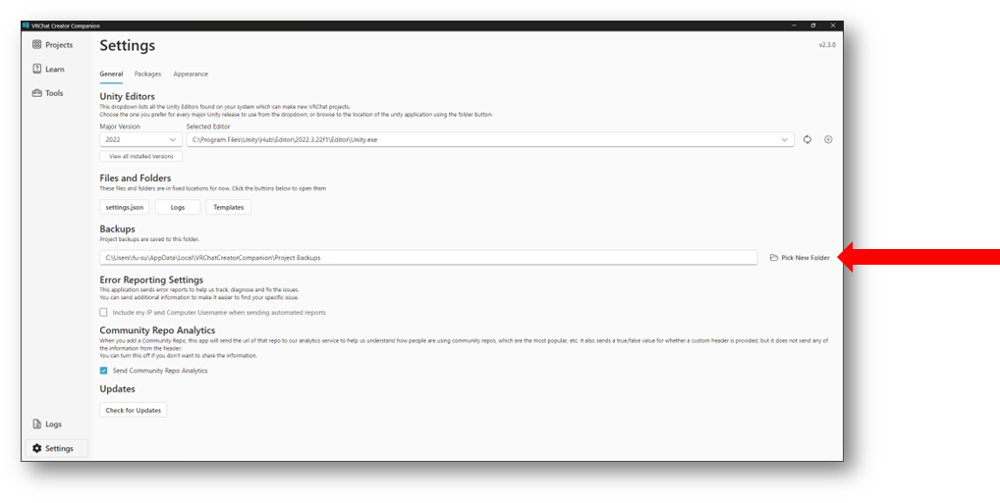
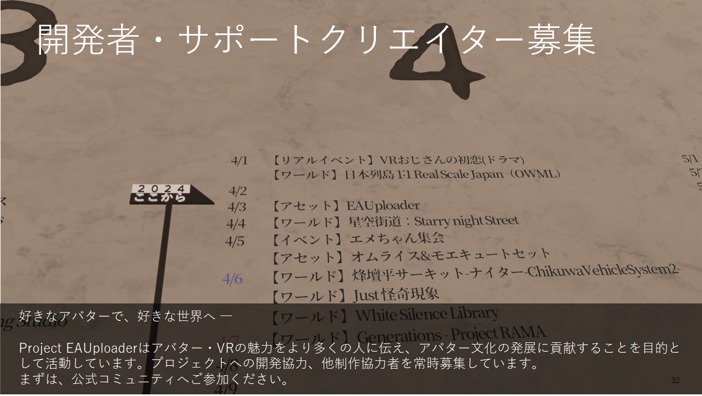

## 주의사항 및 면책조항
* * *
EAUploader는 OSS(오픈 소스 소프트웨어)로 개발되고 제공되는 도구입니다. 제품이 아닙니다.
EAUploader 사용으로 발생한 모든 손해에 대해 Project EAUploader(uslog.tech)는 어떠한 책임도 지지 않습니다.

Unity에는 다양한 버그가 있습니다. 가끔 예측할 수 없고 해결할 수 없는 버그나 충돌이 발생할 수 있습니다. 최악의 경우, 프로젝트를 시작할 수 없게 될 수 있습니다(프로젝트가 손상됩니다).
프로젝트는 백업을 해 두세요.
또한, 아바타 데이터와 같은 중요한 데이터는 프로젝트 외부에도 저장하세요.

## 설치할 내용 설명
* * *
### 설치할 소프트웨어

**・Unity Hub**
- Unity를 관리하기 위한 소프트웨어입니다.
  (Unity는 여러 버전이 있으며, 각각 독립적인 소프트웨어로 작동하기 때문에, Unity Hub는 Unity를 통합해서 관리하고 라이선스 인증을 수행하는 소프트웨어입니다.)

**・Unity Editor**
- Unity 본체입니다. 그러나 이 가이드에서는 다음 Creator Companion을 사용하여 자동으로 설치합니다.

**・Creator Companion**
- VRChat이 배포하는 Unity 프로젝트 관리 소프트웨어입니다.
  일반적으로 VCC로 불립니다.

**설치할 패키지(Unity에 설치할 추가 기능 및 도구)**

**・VRCSDK**
- VRChat이 배포하는 아바타 및 월드를 생성, 편집, 업로드하기 위한 패키지입니다. VCC로 생성한 프로젝트에는 자동으로 추가됩니다.

**・EAUploader**
- EAUploader 본체입니다. Unity 내에서 작동합니다.

EAUploader에서의 작업은 Unity에 변경을 가하는 것입니다. Unity는 일반 작업 상태를 유지하기 위해 종료 시 저장 작업을 수행하지 않습니다.
  EAUploader를 통한 아바타 업로드는 VRCSDK의 기능을 사용하는 것이며, VRCSDK를 사용한 업로드와 동일합니다.

### 문제가 발생했을 때

<aside>
💡 EAUploader 설치나 사용 중 문제가 발생하거나 설명되지 않은 일이 발생하여 해결할 수 없을 때
</aside>

- 공식 EAUploader Discord 서버에 참여하세요. ▷ [https://discord.gg/yYFru7brra](https://discord.gg/yYFru7brra)
- URL이 사용할 수 없는 경우 공식 웹사이트를 확인하세요. ▷ [https://eauploader.uslog.tech](https://eauploader.uslog.tech/)

<aside>
💡 Unity나 VRCSDK의 문제, 구입한 아바타나 기믹, 도구 관련 문제가 발생했을 때
</aside>

- 각 배포원의 지원을 받으세요.
- 지원이 없는 경우 X 등에서 도움을 요청하세요.

## 설치 방법
* * *
### Unity Hub 다운로드

다음 링크에서 Unity Hub를 다운로드하세요.
[https://unity.com/ja/download](https://unity.com/ja/download)

### Unity Hub 실행

다운로드한 파일 UnityHubSetup.exe를 실행하세요.
실행 후 로그인하라는 요청이 표시됩니다.

처음이신 분은 로그인 버튼 아래에 있는 Create account를 클릭하세요.

### 로그인 완료

화면에 따라 계정을 생성하고 로그인하세요.

로그인이 완료되면 Got it을 클릭하여 진행하세요.

*참고: Unity Hub 버전에 따라 표시가 다를 수 있습니다.*

### Unity Editor 설치 건너뛰기

Unity Editor 설치 화면으로 이동합니다.

Skip installation을 클릭하여 이 단계를 건너뛰세요.
나중에 VCC를 통해 설치를 진행합니다.

### 라이선스 인증

Unity Hub의 일반 화면으로 돌아갑니다. 라이선스 인증을 요청하는 메시지가 표시됩니다.

오른쪽 상단 버튼에서 라이선스 인증 화면으로 이동합니다.

### 라이선스 추가

라이선스 관리 화면으로 이동합니다. 라이선스가 표시되지 않는지 확인하세요.

Add license 버튼을 클릭하세요.

개인 라이선스(무료)로 인증을 진행합니다.

Get a free personal license 버튼을 클릭하세요. 이 라이선스를 통해 Unity의 모든 정규 기능을 사용할 수 있습니다.
라이선스는 Unity 계정에 활성화됩니다.

*라이선스 인증이 이루어지면 다른 인증 방법을 사용해도 괜찮습니다.*

동의하고 라이선스를 획득하세요.

이것은 Unity에 대한 동의입니다. 내용을 확인한 후 동의하세요.

라이선스를 추가하면 Unity Hub에서의 작업은 완료됩니다.

### Creator Companion 설치

다음 URL에서 VRChat이 배포하는 프로젝트 관리 소프트웨어를 다운로드하세요.
[https://vrchat.com/home/download](https://vrchat.com/home/download)

다운로드 버튼이 여러 개 있으니 주의하세요. Download the Creator Companion을 클릭하여 다운로드하세요.

*이 소프트웨어는 VCC로 불립니다.*

다운로드한 파일을 실행하여 설치를 진행하세요.

### VCC 실행

설치가 완료되면 소프트웨어를 시작하세요. 안내가 시작됩니다.

Show Me Around을 클릭하여 튜토리얼을 시작하세요.

진행하면 다음과 같은 화면으로 이동합니다.

Continue를 클릭하여 진행하세요.

### Unity Editor 설치

잠시 로딩 시간이 지난 후, Unity Editor가 발견되지 않았다는 로그가 발생합니다.

Continue를 클릭하여 진행하세요.

Unity를 설치하라는 안내가 나옵니다.

Install Unity를 클릭하여 진행하세요.

공식이 추천하는 최신 버전의 Unity 설치 화면이 나옵니다. Install 버튼을 클릭하여 설치를 진행하세요.

*참고: Unity 설치는 시간이 다소 걸릴 수 있습니다*

### Unity 설치 완료

설치가 완료되면 화면이 전환됩니다.

Continue를 클릭하여 진행하세요.

### Unity 준비 완료

Unity와 VCC의 설정이 완료되었습니다.

다음으로, Create New Project를 선택하여 새 프로젝트를 만듭니다.

### 프로젝트 생성

프로젝트는 크게 네 가지로 나뉩니다.
아바타와 월드용 프로젝트가 각각 Unity2019와 2022용으로 두 가지씩 네 가지가 있습니다.

Unity 2022 Avatar Project를 선택하세요. 프로젝트 이름에 적절한 이름을 입력하세요.
그러나 전각 문자는 사용하지 마세요. 업로드할 때 문제가 발생할 수 있습니다. 알파벳, 숫자, 기호만 사용하세요.

입력 후 Create Project를 선택하여 진행하세요.

### EAUploader 추가(VCC에 EAUploader 추가)

프로젝트 관리 화면으로 이동합니다. VCC 패키지는 여기에서 추가, 업데이트, 삭제할 수 있습니다.

VCC에 EAUploader를 추가하려면 [여기](https://eauploader.uslog.tech/)를 클릭하세요.

VCC에 자동으로 팝업이 표시됩니다.
I Understand, Add Repository를 클릭하여 VCC에 EAUploader를 추가하세요.

Manage Packages에서 Easy Avatar Uploader for EAUploader를 찾아 ⊕ 버튼을 클릭하여 추가하세요.

### 프로젝트 실행

오른쪽 상단의 Open Project에서 실행하세요.

### 설치 및 실행 완료

이제 아바타를 업로드할 준비가 되었습니다.

VRM 아바타를 사용하고 싶다면 별도의 가이드 'VRM 사용하기'를 참조하세요.

프로젝트에서는 EAUploader를 닫고 일반 Unity 편집기로 아바타 수정을 할 수 있습니다.

왼쪽 하단은 종료 버튼입니다. EAUploader를 닫으려면 오른쪽 상단의 ✕를 클릭하세요.

## 도구 사용 방법
* * *
### 도구 내 가이드

EAUploader에는 도구 내 가이드가 있습니다.

도구 사용 방법, 셰이더, 플러그인, 업로드 등에 대한 설명은 도구 내 가이드를 읽어주세요.

### 백업 방법

VCC 프로젝트 목록에서 백업하려는 프로젝트의 가장 오른쪽 ...을 클릭하세요.

백업 위치는 VCC의 왼쪽 하단 Settings에서 Backups에서 확인할 수 있습니다. 여기에서 변경도 가능합니다.

## 안내
* * *
### 공식 커뮤니티

공식 EAUploader Discord 서버에 꼭 참여하세요.
업데이트 및 프로젝트 최신 정보를 알려드립니다.

또한, EAUploader에 대한 의견이나 제안도 가능합니다.

꼭 참여해 주세요.
https://discord.gg/yYFru7brra

### 공식 VRChat 그룹

VRChat에서 이벤트를 개최하고 있습니다.
또한, EAUploader를 소개할 때나 참조 링크로 사용할 때 꼭 참여하세요.

https://vrc.group/EAUP.0512

### 개발자 및 지원 크리에이터 모집

### 문제가 발생했을 때

<aside>
💡 EAUploader 설치나 사용 중 문제가 발생하거나 설명되지 않은 일이 발생하여 해결할 수 없을 때

</aside>

- 공식 EAUploader Discord 서버에 참여하세요. ▷ [https://discord.gg/yYFru7brra](https://discord.gg/yYFru7brra)
- URL이 사용할 수 없는 경우 공식 웹사이트를 확인하세요. ▷ [https://eauploader.uslog.tech](https://eauploader.uslog.tech/)

<aside>
💡 Unity나 VRCSDK의 문제, 구입한 아바타나 기믹, 도구 관련 문제가 발생했을 때

</aside>

- 각 배포원의 지원을 받으세요.
- 지원이 없는 경우 X 등에서 도움을 요청하세요.

### 문의하기

개인, 법인 상관없이 Project EAUploader 또는 운영 엔티티 USLOG에 문의하실 경우, 다음 링크를 사용해 주세요.

[https://uslog.tech/contact](https://uslog.tech/contact)

새 사용자를 위한 가이드 v1.1

2024년 7월 25일

USLOG (uslog.tech)

Project EAUploader
