本指南由Avatar Store制作，Project EAUploader制作。

官方角色 Ia 设计 Ebihana

## 注意事项和免责声明

EAUploader是一款开源软件工具，由Project EAUploader（uslog.tech）开发和提供。它不是一个产品。
对于使用EAUploader导致的任何损害，Project EAUploader（uslog.tech）概不负责。

Unity存在各种各样的错误。偶尔会发生意料之外、无法解决的错误和崩溃。最糟糕的情况是项目无法启动（项目损坏）。
请务必备份项目（参考[本页安装后备份的方法](https://www.notion.so/0242373641d6453daf917dbc912e8293?pvs=21)）。
此外，请将重要的数据（如角色数据）保存在项目之外。

## 安装说明

### 安装软件

**· Unity Hub**
- 用于管理Unity的软件。
（Unity有多个版本，每个版本都是独立的软件，Unity Hub用于管理和授权这些软件）

**· Unity Editor**
- Unity的核心软件。但在本指南中，我们将使用Creator Companion进行自动安装。

**· Creator Companion**
- VRChat提供的Unity项目管理软件。
- 通常称为VCC。

**安装的包（在Unity中安装的附加功能和工具）**

**· VRCSDK**
- VRChat提供的用于创建、编辑和上传角色和世界的软件包。
- VCC创建的项目会自动添加此软件包。

**· EAUploader**
- EAUploader的核心软件。在Unity中运行。

EAUploader在Unity中进行操作。为了保持正常工作状态，Unity会自动保存更改。
使用EAUploader上传角色与使用VRCSDK相同。

### 遇到问题时

<aside>
💡 如果在安装和使用EAUploader过程中遇到问题，或者遇到未在说明中提到的问题

</aside>

- 请加入EAUploader官方Discord服务器。 ▷ [https://discord.gg/yYFru7brra](https://discord.gg/yYFru7brra)
- 如果无法使用URL，请查看官方网站。 ▷ [https://eauploader.uslog.tech](https://eauploader.uslog.tech/)

<aside>
💡 如果遇到与Unity或VRCSDK相关的问题，或者遇到购买的角色、机关或工具相关的问题

</aside>

- 请联系各自的提供方获取支持。
- 如果没有支持，请在X等地寻求帮助。

## 安装方法

### 下载Unity Hub

从以下链接下载UnityHub。
[https://unity.com/ja/download](https://unity.com/ja/download)

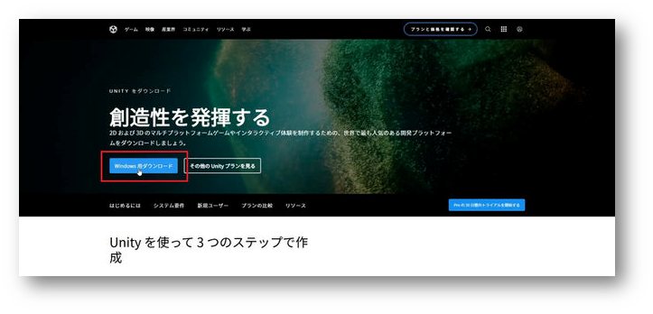

### 启动Unity Hub

运行下载的文件UnityHubSetup.exe。
启动后，将提示您登录。

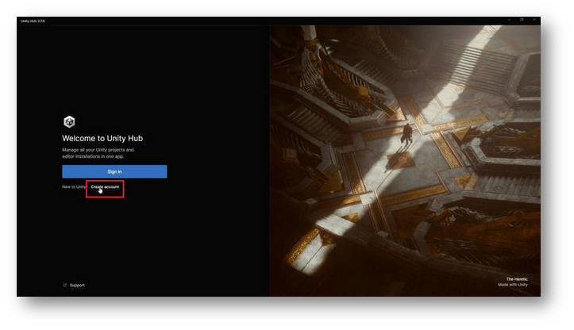

如果是第一次使用，请单击“Create account”按钮下方的Create account创建帐户。

### 完成登录

按照屏幕上的指示创建帐户并完成登录。

完成登录后，点击“Got it”继续。

※根据Unity Hub的版本，显示可能会有所不同。

### 跳过安装Unity Editor

将转到Unity Editor的安装界面。

在此处点击“Skip installation”跳过安装。
稍后将在VCC中进行安装。

### 许可证认证

将转到Unity Hub的常规界面。顶部会显示要求进行许可证认证的消息。

从右上角的按钮转到许可证认证界面。

### 添加许可证

将转到许可证管理界面。确保许可证列表中没有显示任何内容。

点击“Add license”按钮。

选择个人许可证（免费）进行认证。

点击“Get a free personal license”按钮。此许可证可以使用Unity的所有常规功能。
许可证将与Unity帐户关联。

※只要能进行许可证认证，使用其他认证方法也可以。

同意并获取许可证。

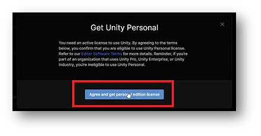

这是对Unity的同意。请仔细阅读内容，然后同意。

添加许可证后，Unity Hub的操作就完成了。

### 安装Creator Companion

从以下URL下载VRChat官方提供的项目管理软件。
[https://vrchat.com/home/download](https://vrchat.com/home/download)

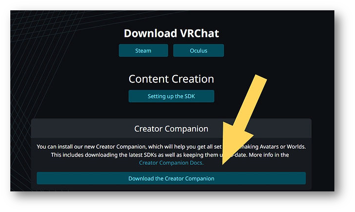

请注意，有几个下载按钮，请点击“Download the Creator Companion”进行下载。

※这就是VCC软件。

运行下载的文件并进行安装。

### 启动VCC

安装完成后，请启动VCC。将显示引导信息。

点击“Show Me Around”开始教程。

继续，将转到以下界面。

点击“Continue”继续。

### 安装Unity Editor

稍等片刻后，将出现Unity Editor未找到的日志。

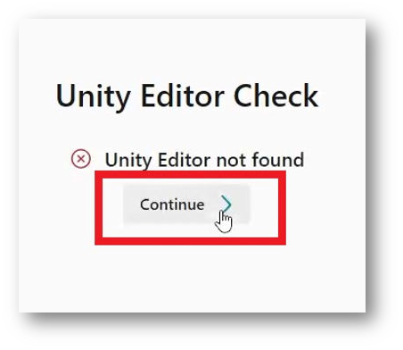

点击“Continue”继续。

将提示安装Unity。

点击“Install Unity”继续。

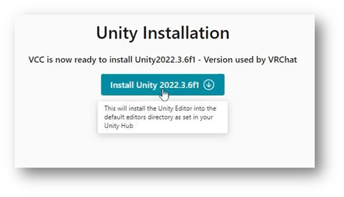

这是官方推荐的最新版本Unity的安装界面。点击Install按钮进行安装。

※Unity的安装需要一些时间

### Unity安装完成

安装完成后，将转到以下界面。

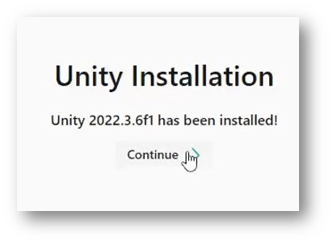

点击“Continue”继续。

### Unity准备就绪

Unity和VCC的设置已完成。

然后，从“Create New Project”创建新项目。

### 创建项目

项目分为四种类型。
Unity2019和2022各有两种类型的项目，用于角色和世界。

选择“Unity 2022 Avatar Project”。在Project Name中输入一个适当的名称。
但请不要使用全角字符。这可能导致无法上传。请只使用半角字母、数字和符号。

输入后，点击“Create Project”继续。

### 添加EAUploader（在VCC中添加EAUploader）

将转到项目管理界面。您可以在此处添加、更新和删除VCC软件包。

要在VCC中添加EAUploader，请点击[这里](https://eauploader.uslog.tech/)。

VCC将自动弹出。点击“I Understand, Add Repository”将EAUploader添加到VCC中。

在“Manage Packages”中找到“Easy Avatar Uploader for EAUploader”，点击⊕按钮进行添加。

### 启动项目

请点击右上角的“Open Project”启动项目。

### 安装和启动完成

现在已准备好上传角色。

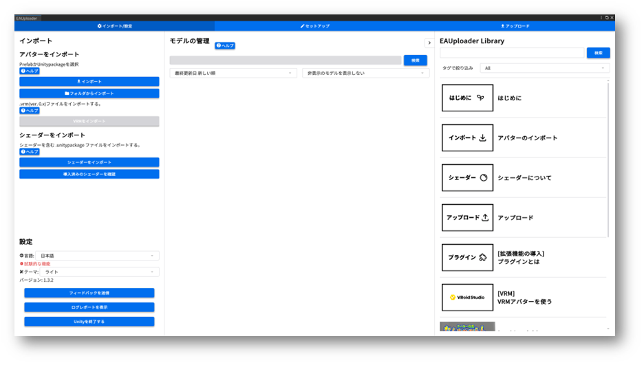

如果您想使用VRM角色，请参考单独的指南“使用VRM”。

在项目中，您可以关闭EAUploader并在Unity编辑器中进行角色修改。

左下角是退出按钮。如果要关闭EAUploader，请点击右上角的✕。

## 安装后

### 工具内的指南

EAUploader内置了指南。

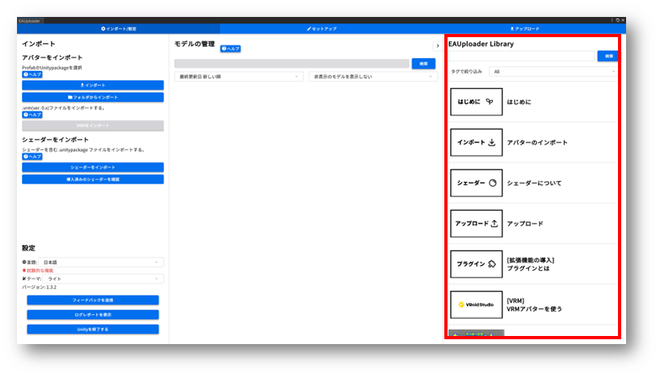

请阅读工具内的指南，了解工具的使用方法、着色器、插件和上传等方面的说明。

### 备份方法

在VCC的项目列表中，单击要备份的项目最右侧的…。

备份的保存位置可以在VCC的左下角的Settings中查看和更改。

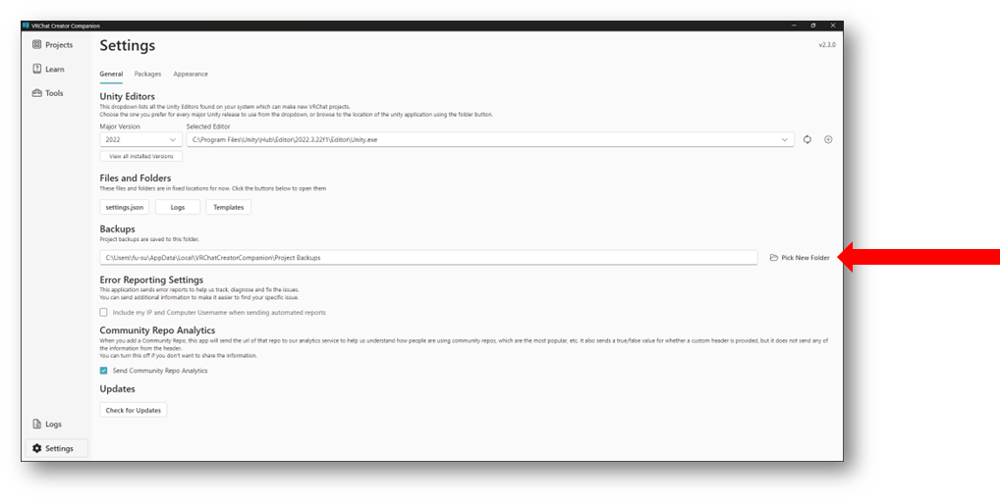

## 联系我们

请通过以下链接与Project EAUploader或USLOG（uslog.tech）联系。

[https://uslog.tech/contact](https://uslog.tech/contact)

初学者指南 v1.0
2024年5月15日
USLOG（uslog.tech）
Project EAUploader

## 选项

### 启动项目（导入软件包）

转到项目管理界面。您可以在此处添加、更新和删除VCC软件包。

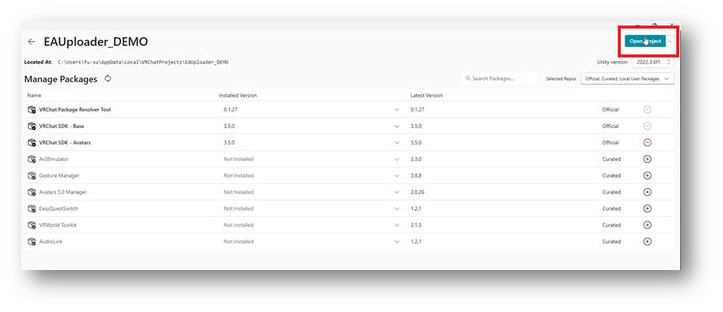

不进行任何更改，点击“Open Project”启动Unity。

这里是使用传统的导入软件包并添加的方法。
除非有特殊原因，否则请在之前的“[VCC中添加EAUploader](https://www.notion.so/0242373641d6453daf917dbc912e8293?pvs=21)”方法中安装EAUploader。

### 添加EAUploader

启动Unity后，从下载的EAUploader文件夹中将Unity软件包拖放到Unity中。

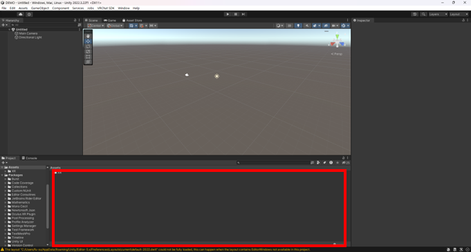

这是默认的Unity界面。将文件拖放到红框中。

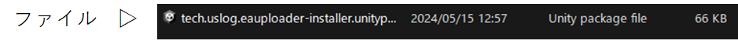

将显示导入界面。点击Import进行导入。

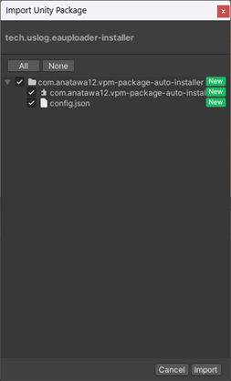

导入后，EAUploader将自动添加到项目中并启动。

此软件包用于将EAUploader添加到VCC中。导入后，VCC中将添加Easy Avatar Uploader for VRChat。

对于第二个及以后的项目，请在VCC中添加EAUploader。

