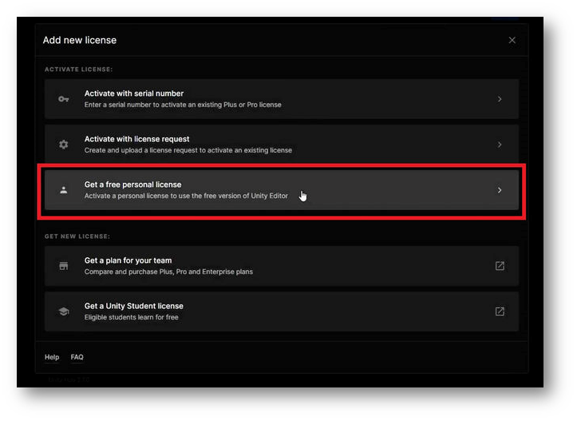
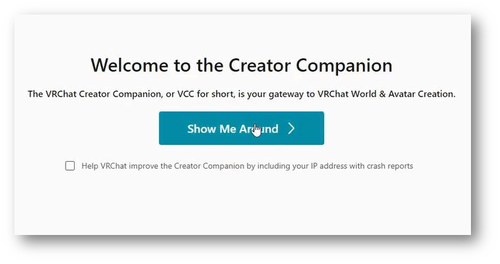

## 注意事项与免责声明
* * *
EAUploader作为开源软件（OSS）开发和提供。它不是一个产品。
Project EAUploader(uslog.tech)不对使用EAUploader可能造成的任何损害承担任何责任。

Unity存在各种bug。有时可能会发生意外的、无法解决的bug或崩溃。在最坏的情况下，项目可能无法启动（项目可能会损坏）。
请确保备份您的项目。
此外，请将头像数据等重要数据保存在项目外部。

## 安装内容说明
* * *
### 要安装的软件

**・Unity Hub**
- 管理Unity的软件。
  (由于Unity有多个版本，每个版本都作为独立的软件运行，因此Unity Hub是管理和认证Unity许可证的软件。)

**・Unity Editor**
- Unity的主体。但在本指南中，将使用以下Creator Companion自动安装。

**・Creator Companion**
- VRChat分发的Unity项目管理软件。
  通常被称为VCC。

**要安装的包（在Unity中安装的额外功能和工具）**

**・VRCSDK**
- VRChat分发的用于创建、编辑和上传头像和世界的包。它会自动添加到用VCC创建的项目中。

**・EAUploader**
- EAUploader的主体。它在Unity内运行。

EAUploader中的操作会对Unity进行更改。Unity为了保持常规工作状态，不会在退出时保存更改。
  通过EAUploader上传头像使用了VRCSDK的功能，与使用VRCSDK上传相同。

### 遇到问题时

<aside>
💡 如果在安装或使用EAUploader时遇到问题，或者发生了未说明的事情而无法解决
</aside>

- 请加入官方EAUploader Discord服务器。 ▷ [https://discord.gg/yYFru7brra](https://discord.gg/yYFru7brra)
- 如果URL不可用，请检查官方网站。 ▷ [https://eauploader.uslog.tech](https://eauploader.uslog.tech/)

<aside>
💡 如果遇到Unity或VRCSDK的问题，或与购买的头像、小工具或工具相关的问题
</aside>

- 请向各自的发行方寻求支持。
- 如果没有支持，请在X等平台寻求帮助。

## 安装方法
* * *
### 下载Unity Hub

从以下链接下载Unity Hub：
[https://unity.com/ja/download](https://unity.com/ja/download)

### 启动Unity Hub

运行下载的文件UnityHubSetup.exe。
启动后，系统会要求您登录。

如果您是第一次使用，请点击登录按钮下方的Create account。

### 完成登录

按照屏幕指示创建账户并登录。

登录完成后，点击Got it继续。

*注意：显示可能因Unity Hub的版本而异*

### 跳过安装Unity Editor

您将被带到Unity Editor的安装屏幕。

点击Skip installation跳过此步骤。
稍后将通过VCC进行安装。

### 许可证认证

您将返回到Unity Hub的常规屏幕。屏幕上会出现要求认证许可证的消息。

从右上角的按钮进入许可证认证屏幕。

### 添加许可证

您将进入许可证管理屏幕。确保没有显示任何许可证。

点击Add license按钮。

使用个人许可证（免费）进行认证。

点击Get a free personal license按钮。此许可证允许您使用Unity的所有常规功能。
许可证将激活您的Unity账户。

*只要进行了许可证认证，即可使用其他认证方法。*

同意并获取许可证。

这是对Unity的同意。请检查内容并同意。

添加许可证后，您在Unity Hub中的操作就完成了。

### 安装Creator Companion

从以下URL下载VRChat分发的项目管理软件：
[https://vrchat.com/home/download](https://vrchat.com/home/download)

注意下载按钮有几个。点击Download the Creator Companion下载。

*这个软件通常被称为VCC。*

运行下载的文件并继续安装。

### 启动VCC

安装完成后，启动软件。指导将开始。

点击Show Me Around开始教程。

继续，您将转到以下屏幕。

点击Continue继续。

### 安装Unity Editor

短暂的加载时间后，将出现未找到Unity Editor的日志。

点击Continue继续。

将引导您安装Unity。

点击Install Unity继续。

您将看到官方推荐的最新版本Unity的安装屏幕。点击Install按钮继续安装。

*注意：安装Unity可能需要一些时间*

### Unity安装完成

安装完成后，屏幕将转换。

点击Continue继续。

### Unity设置完成

您已完成Unity和VCC的设置。

接下来，选择Create New Project创建新项目。

### 创建项目

项目大致分为四种类型。
头像和世界的项目分别有Unity2019和2022的两种类型，共四种。

请选择Unity 2022 Avatar Project。为项目起一个合适的名字。
但是不要使用全角字符。这可能会在上传时导致问题。只使用英文字母、数字和符号。

输入后选择Create Project继续。

### 添加EAUploader（在VCC中添加EAUploader）

您将进入项目管理屏幕。VCC包可以在此添加、更新或删除。

要将EAUploader添加到VCC，请点击[这里](https://eauploader.uslog.tech/)。

VCC将自动显示弹出窗口。
点击I Understand, Add Repository将EAUploader添加到VCC。

在Manage Packages中找到Easy Avatar Uploader for EAUploader，点击⊕按钮添加。

### 启动项目

从右上角的Open Project启动。

### 安装和启动完成

您现在已准备好上传头像。

如果您想使用VRM头像，请参考单独的指南“使用VRM”。

在项目中，您可以关闭EAUploader并作为常规Unity编辑器修改头像。

左下角是退出按钮。要关闭EAUploader，请点击右上角的✕。

## 工具使用方法
* * *
### 工具内指南

EAUploader内有一个指南。

有关工具、着色器、插件、上传等的说明，请阅读工具内指南。

### 备份方法

在VCC项目列表中，点击您想备份的项目最右边的...。

备份位置可以在VCC左下角的Settings中的Backups下确认。您也可以在此更改。

## 信息
* * *
### 官方社区

请加入官方EAUploader Discord服务器。
我们会公布更新和最新项目信息。

您也可以向EAUploader提供反馈和建议。

请加入我们。
https://discord.gg/yYFru7brra

### 官方VRChat小组

我们在VRChat上举办活动。
此外，请在介绍EAUploader或作为参考链接时加入我们。

https://vrc.group/EAUP.0512

### 开发者及支持创作者招募

### 遇到问题时

<aside>
💡 如果在安装或使用EAUploader时遇到问题，或者发生了未说明的事情而无法解决

</aside>

- 请加入官方EAUploader Discord服务器。 ▷ [https://discord.gg/yYFru7brra](https://discord.gg/yYFru7brra)
- 如果URL不可用，请检查官方网站。 ▷ [https://eauploader.uslog.tech](https://eauploader.uslog.tech/)

<aside>
💡 如果遇到Unity或VRCSDK的问题，或与购买的头像、小工具或工具相关的问题

</aside>

- 请向各自的发行方寻求支持。
- 如果没有支持，请在X等平台寻求帮助。

### 联系我们

无论个人还是公司，如果您需要联系Project EAUploader或运营实体USLOG，请使用以下链接。

[https://uslog.tech/contact](https://uslog.tech/contact)

新用户指南 v1.1

2024年7月25日

USLOG (uslog.tech)

Project EAUploader
